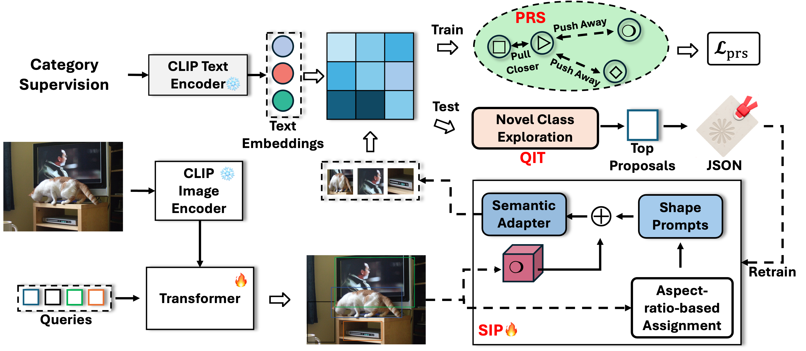

# Shape-Invariant Prompt Learning with Prompt Relation Structuring for Open-Vocabulary Object Detection

> **Shape-Invariant Prompt Learning with Prompt Relation Structuring for Open-Vocabulary Object Detection**  
> [Zhaocheng Xu](https://github.com/messeyAmumu), Yan Tian, Lili Yang, Ling Ding, Ruili Wang 

## Overview

We propose SIP-OVD, a shape-invariant prompt learning framework for open-vocabulary object detection based on [CORA](https://arxiv.org/abs/2303.13076). Our method demonstrates **state-of-the-art** results on both COCO and LVIS OVD benchmarks.
